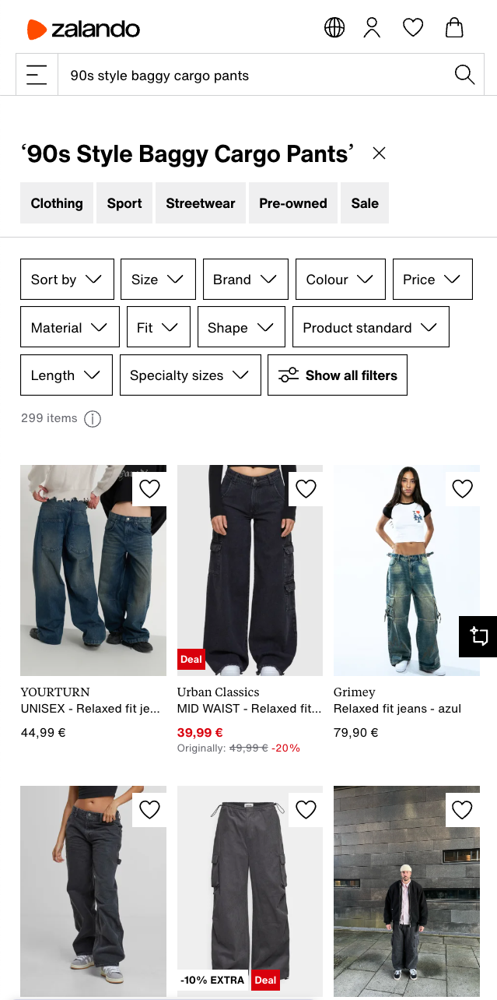
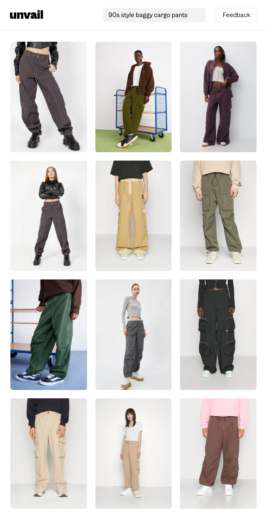

## The Current State of E-commerce Search

Think about the last time you searched for something on an e-commerce site like Zalando. What did you do? Most likely, you either clicked through countless categories (Men → Pants → ...) or attempted to use the search bar. If you tried searching, you probably found the results disappointing and retreated back to browsing categories. This frustrating experience is surprisingly common—but why?

## The Problem with Text-Based Search

The core issue lies in how most e-commerce websites handle search. Their search systems are fundamentally text-based, meaning your search query "colorful summer dress" gets compared against product titles and descriptions to find matches.

:::tip[Text-based Search]
When you type "colorful summer dress" into a search bar, the algorithm first breaks down your query into individual words or "tokens." These tokens might include variations like "color," "colorful," "summer," and "dress." The search then looks for exact or partial matches in product titles and descriptions. More sophisticated systems might also understand synonyms (like "vibrant" for "colorful") or handle misspellings. Results are usually ranked based on how many tokens match and where they appear - a match in the title typically ranks higher than one in the description.
:::

This approach has a critical flaw: it relies entirely on accurate and detailed product descriptions. For a platform like Zalando, with over half a million products, maintaining high-quality descriptions for every item is a massive challenge. Since Zalando operates as a marketplace, this responsibility falls to individual brands, who must provide detailed, accurate descriptions for each product they list. In practice, this rarely happens consistently.

## How Customers Actually Shop

Here's the interesting part: while e-commerce platforms depend heavily on text descriptions for search, that's not how customers make buying decisions. Think about it—would you buy something based solely on its description? Of course not! That's why every product listing includes at least one image. Images are the primary way customers evaluate products and make purchasing decisions. (How do visually impaired people make their shopping decisions??)

If customers primarily rely on product images to make decisions, shouldn't our search systems do the same?

## Enter AI and Cross-Modal Search

Thanks to recent advances in artificial intelligence, we can now build search systems that understand both images and text. This approach is called cross-modal search, and it represents a fundamental shift in how e-commerce search can work.

Instead of just matching your text query against product descriptions, cross-modal search can directly compare your search intent against product images. Previously, this was practically impossible—how could you meaningfully compare text strings against pixel values? It would be like comparing apples to oranges, as they're completely different types of data (or "modalities" in technical terms).

## The Technical Solution: CLIP and Embeddings

The breakthrough came with a technology called Contrastive Language-Image Pretraining (CLIP). At its core, CLIP learns to understand both images and text by training on millions of image-text pairs. It creates what we call "embeddings"—mathematical representations that capture the meaning of both images and text in the same format.

:::tip[Embedding based text search]
Traditional text search has evolved with the introduction of embeddings. Instead of just matching words, embedding-based search converts words into high-dimensional vectors that capture their meaning. For example, "dress" and "gown" would have similar vector representations because they're semantically related. This means searching for "evening gown" might successfully find a product labeled "formal dress" because their embeddings are close in vector space. These embeddings are typically created using large language models trained on vast amounts of text data, allowing them to understand contextual relationships between words.
:::

For an e-commerce platform, this means we can:

1. Generate embeddings for all product images in our catalog
2. Convert customer search queries into the same type of embedding
3. Find products by comparing these embeddings

:::tip[How do we compare embedding vectors?]
Embedding vectors are typically compared using similarity metrics like cosine similarity or Euclidean distance. Cosine similarity is particularly popular because it measures the angle between vectors, making it less sensitive to the absolute magnitudes. For example, if we have two 512-dimensional vectors representing a search query "red leather jacket" and a product image of a red leather jacket, we calculate their cosine similarity. Values closer to 1 indicate high similarity, while values closer to 0 indicate dissimilarity. In practice, these calculations are optimized using techniques like approximate nearest neighbor search (ANN) to handle millions of products efficiently.
:::

## Why This Matters for Everyone

You might think, "My customers rarely use search, so why should I care?" There are two important reasons:

1. Consider why customers avoid using search: they've been conditioned by years of poor experiences. They've learned that searching usually wastes time, so they default to browsing categories instead. This isn't user preference—it's learned helplessness.

2. From a business perspective, category-based browsing severely limits your understanding of customer needs. When customers can only browse existing categories, you'll never know what products they're actually looking for but can't find. With effective cross-modal search, however, every search query becomes valuable market research. Customer searches tell you exactly what products they want, allowing you to adjust your inventory and offerings accordingly.

This shift from category-based browsing to intuitive, image-aware search doesn't just make shopping more convenient—it fundamentally changes how businesses can understand and respond to customer needs.

## Try It Yourself: A Real-World Demo

Theory is one thing, but seeing is believing. I've built a live demonstration at [unvail.app](https://unvail.app) where you can experience cross-modal search firsthand. The demo lets you search through approximately half a million real Zalando products—the same massive catalog we discussed earlier.

  
  

Unlike Zalando's native search, Unvail uses the AI-powered cross-modal approach we've explored. Try searching for something specific like "90s style baggy cargo pants" or "cozy knit sweater in earth tones" and watch how the system understands and matches your intent with visually similar products.

For a real eye-opener, try running the same search on Zalando's website yourself and compare the results. The difference in relevance and accuracy shows just how powerful AI-driven visual search can be. This isn't just a proof of concept; it's a working example of how e-commerce search could and should work for everyone. Go ahead, give it a try and experience the future of online shopping search yourself.

